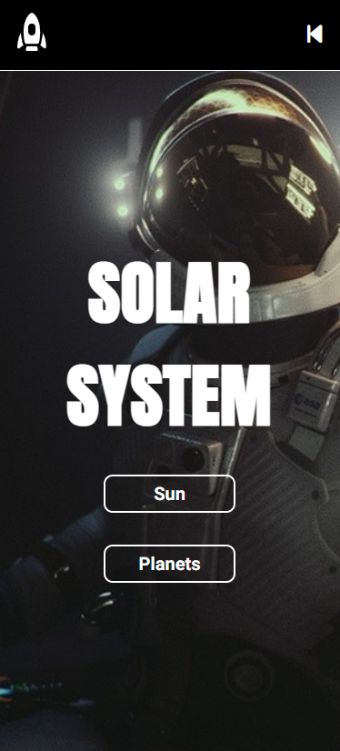

 

<h1><strong>CONSUMO API - SOLAR SYSTEM</strong></h1>

|      MOBILE         |          DESKTOP       |
|:-------------------:|:-----------------------:
|||

[Clique aqui](https://solarsystem-pwf.netlify.app/) para acessar o site. 

## **Escopo**

O objetivo do projeto é realizar o consumo de uma API Pública. Escolhi como tema o Sistema Solar. 

- [Link da API](https://api.le-systeme-solaire.net/)

## **Tecnologias Utilizadas**

- HTML
- CSS
- Markdown
- Responsividade
- JavaScript
- Web Components

## **Figma**
Utilizando a ferramenta de design Figma, foi planejado o breakpoint. 
Segue o link: 

- [Link do Figma](https://www.figma.com/file/h6MHpUzeS9PW2gzmtehGOv/Solar-System?t=y0PX2mk1lxQrKAEh-0)

## **Deploy**
A hospedagem do site foi feita no Netlify. Segue o link: 

- [Link do deploy no Netlify](https://solarsystem-pwf.netlify.app/)

## **Problemas Encontrados**
Ao utilizar WebComponents, tive problemas, pois o Font Awesome por conta do shadow root (que encapsula as tags e os estilos), não conseguiu identificar as tags. Para resolver tal problema, segue a documentação:

- [Link do Notion](https://longing-fish-b4f.notion.site/DOCUMENTA-O-DE-PROBLEMAS-6304b013f8c64868b76940b4abbfb6c1)

## **Critérios de avaliação**

- [ ]  Documentou problemas, se encontrado, para futuras consultas?
- [x]  Foi criado o layout no figma?
- [x]  A página foi construída seguindo o planejado no Figma?
- [ ]  A página funciona em dispositivos diferentes?
- [x]  Foi consumida a API escolhida?
- [x]  Foi criado web componentes?
- [ ]  Foi criado um padrão de roteamente para as paginas?
- [ ]  As funções foram criadas seguindo à boa prática de responsabilidade única?
- [ ]  Quando possível, foi criado funções puras?
- [x]  O projeto está publicado?
- [x]  Foi criado o arquivo README.md?

## **Autora**

| NOME                                                                                                                                                                                      |                                                     GITHUB                                                      |                                       FOTO                                       |
| :----------------------------------------------------------------------------------------------------------------------------------------------------------------------------------------- | :-------------------------------------------------------------------------------------------------------------: | :------------------------------------------------------------------------------: |
|  |      | </a> |
